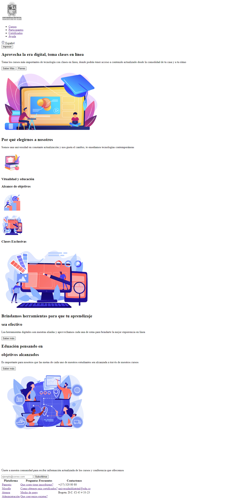
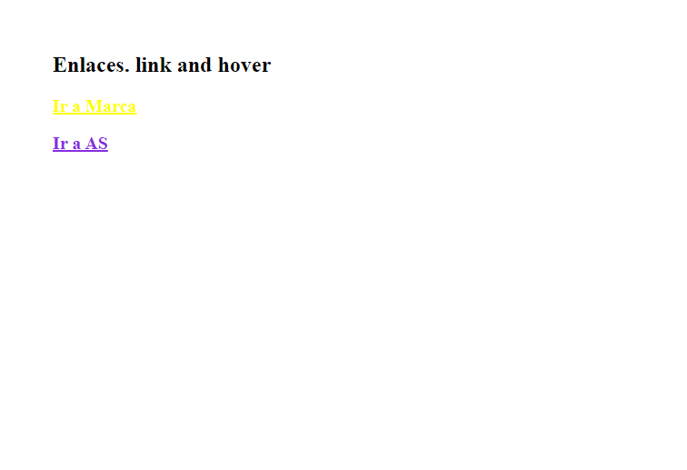
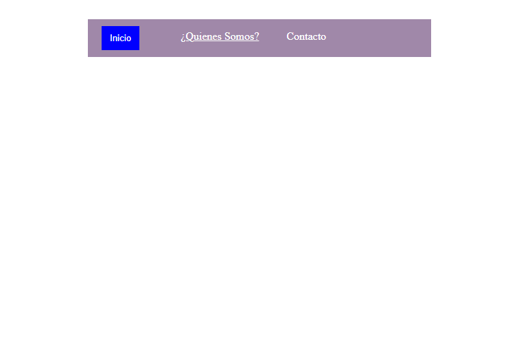
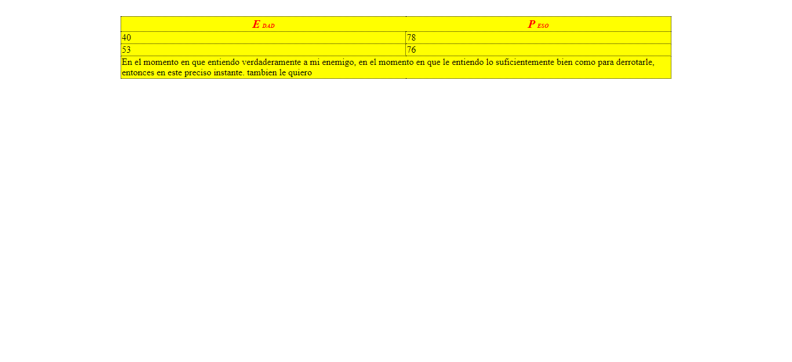

# Activida9

<h2>Información</h2>

Curso: Full Stack Basico - Grupo 1

Profesor: Cristian Patiño

Estudiante: Gonzalo Franch Escobar

 
<a href="https://GonzaloEscobar17.github.io/Activida9/index.html/">Link pagina</a>

<h2>Punto 2: html </h2>

<h2>Punto 3: CSS </h2>

<h2>Punto 4: html y CSS </h2>

<h2>Punto 5: html y CSS </h2>

<h2>Punto 6: html y CSS </h2>

<h2>Punto 7-8: html y CSS </h2>

<h2>Punto 9: html y CSS </h2>
 

<h2>Link del Repositorio </h2>
<link>https://github.com/GonzaloEscobar17/Activida9.git</link> 
